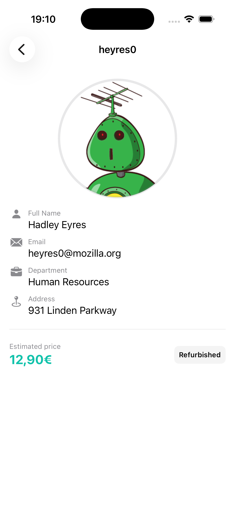
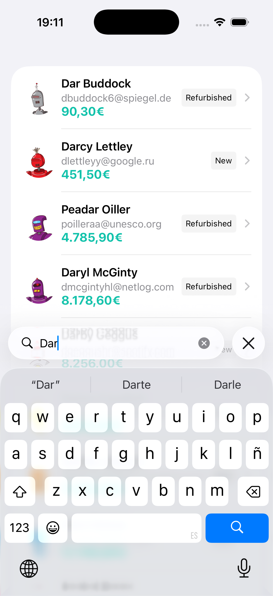
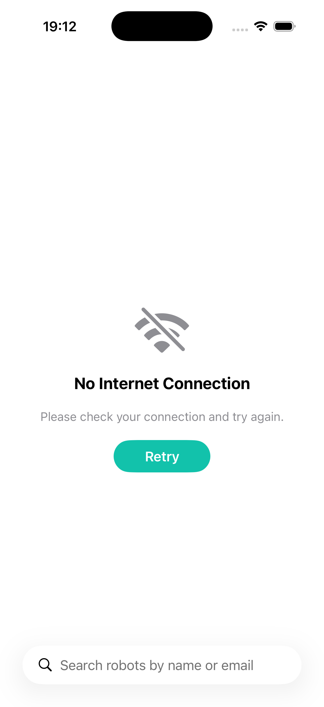

# 🤖 WallaRobots Challenge

This App consist of a robot directory and detail viewer, focused on **high decoupling**, **architectural scalability**, and **optimized SwiftUI performance**.

 | App Icon | Dark Mode | 
 | :--: | :--: |
 |  |  |

---

## Architecture & Technical Decisions

I opted for **MVVM** as the primary architectural pattern due to its synergy with SwiftUI's reactive data flow.

My main focus was writing clean, testable, and maintainable code with a clear separation of concerns. I also paid close attention to rendering optimization within SwiftUI to ensure a smooth user experience.

To demonstrate versatility, I used a hybrid image loading strategy: Kingfisher for the main list (leveraging its robust caching) and AsyncImage for the detail view.

Finally, I leveraged Swift 6 concurrency features to ensure thread safety and a responsive UI, along with Combine’s debounce operator to optimize search performance.

---

## Testing
* **Unit Testing (Swift Testing & XCTest):** Focused on ViewModel logic, validating initial load, filtering, and pagination behavior.
* **Integration (Swift Testing):** Focused on the entire ViewModel state, when performing several actions simulating the user interaction including debouncing when searching and pagination.
* **UI Testing (XCUITest):** Integration tests to ensure navigation flow between list and detail views and data consistency.
* **Snapshot Testing:** Using swift-snapshot-testing by [Pointfree](https://github.com/pointfreeco/swift-snapshot-testing) to test some screens using snapshots.

---

## Continuous Integration (CI/CD)

Automated workflows via **GitHub Actions** ensure project stability on every `Pull Request` and `push` to master:

* **SwiftLint Workflow:** Automated code style analysis to ensure contributions adhere to defined best practices and maintain a clean, uniform codebase.
* **Unit & UI Testing Workflow:** Automated test execution on macOS 26 with Xcode 26.3. The workflow builds and runs tests on an iPhone 17 simulator, blocking merges if any test fails.

---

## Git Strategy
This project follows a branching model inspired by **Git Flow**.

Configured GIT-LFS to optimize the size of the repository (snapshot images).

*Branches have been intentionally preserved to showcase the incremental development process.*

---

## Credits & Data Sources
* **Icon Design:** Custom app icon created using Apple [Icon Composer](https://developer.apple.com/icon-composer/).
* **Image API:** Using [Robohash](https://robohash.org/) for dynamic robot avatar generation.
* **Data Source:** Due to the original Marvel API's unavailability, a remote endpoint with a dummy employee dataset from previous training stages was used.
* **CI/CD Tooling:** [SwiftLint Action](https://github.com/marketplace/actions/github-action-for-swiftlint) (based on the work by **norio-nomura**), used to automate code style enforcement.

---

## 📱 Screenshots
| List View | Detail View | Search | Offline View |
| :---: | :---: | :---: |  :---: |
|  |  |  |  |

---

## Future improvements
* **Localization:** Implementing localization support to make the app accessible to a wider audience.
* **Offline Support (Persistence):** Implementing a more robust offline mode with better error handling and user feedback, persist data using SwiftData.
* **Analytics & Observability:** Integrating analytics to track user interactions and identify areas for improvement.
* **Search Enhancements:** Implementing advanced search features such as filtering by robot attributes or sorting options.
* **CI snapshots:** Adding snapshot testing to the CI workflow to catch UI regressions early. I didn't have time to make it work.

---

## Requirements & Setup
* **iOS:** 17.0+
* **Swift:** 6.0 (Strict Concurrency compatible)
* **Xcode Previews:** The `test_robots.json` file is included in the App's **Target Membership** to ensure Previews work correctly with mock data.

---

### Installation
1. Clone the repository.
2. Open `WallaRobots.xcodeproj`.
3. Build and Run. Dependencies (Kingfisher) are managed automatically via Swift Package Manager.
